```{r, echo=FALSE, message=FALSE, comment=NA}
library(PortfolioAnalytics)
require(methods)
```


## Overview
* Discuss Portfolio Optimization
* Introduce PortfolioAnalytics
* Demonstrate PortfolioAnalytics with Examples

<!--
* Discuss Portfolio Optimization
    * Background and challenges of portfolio theory
* Introduce PortfolioAnalytics
    * What PortfolioAnalytics does and the problems it solves
* Demonstrate PortfolioAnalytics with Examples
    * Brief overview of the examples I will be giving
    * use random portfolios to explore the feasible space of constrained portfolios
    * demonstrate framework to solve hierarchical portfolio optimization problem
-->

---

## Modern Portfolio Theory
"Modern" Portfolio Theory (MPT) was introduced by Harry Markowitz in 1952.

In general, MPT states that an investor's objective is to maximize portfolio
expected return for a given amount of risk.

Common Objectives

* Maximize a measure of gain per unit measure of risk
* Minimize a measure of risk

How do we define risk? What about more complex objectives and constraints?

<!--
Although Modern Portfolio Theory was introduced over 60 years ago, it
establishes a framework for defining and evaluating objectives. In the Modern
Portfolio Theory framework, the optimal portfolio for an investor to hold is the
portfolio that maximizes portfolio expected return for a given level of risk.
The academic approach follows the Markowitz approach using mean return as a
measure of gain and standard deviation of returns as a measure of risk. However,
most real world problems consider different measures of risk as well as multiple
objectives and constraints.
-->

---

## Portfolio Optimization Objectives

* Minimize Risk
    * Volatility, Tail Loss (VaR, ES), Max Drawdown, etc.
* Maximize Risk Adjusted Return
    * Sharpe Ratio, Information Ratio, etc.
* Risk Budgets
    * Equal Component Contribution to Risk (i.e. Risk Parity)
    * Limits on Component Contribution
* Maximize a Utility Function
    * Quadratic, Constant Relative Risk Aversion (CRRA), etc.
* Minimize Tracking Error
  * replicating portfolio to track an index or basket of assets

<!--
Here are some common objectives

* Minimize risk for different definitions of risk
* Maximize risk adjusted return
  * sharpe ratio, information ratio
* Form a portfolio based on the risk contribution of each asset
* Maximize a utility function
* track an index, fund, or set of funds with minimal tracking error
* How do we formulate and solve a portfolio optimization based on these
  objectives?
-->


---

## Challenges of Portfolio Optimization in R

* Many solvers are not specific to portfolio optimization
* Understanding the capabilities and limits of solvers to select the appropriate
  solver for the problem or formulate the problem to fit the solver.
* Lack of a common interface to a wide range of solvers in R, difficult to
  switch between solvers.
* Closed-Form vs. Global Solvers

<!--
Portfolio optimization is a hard problem. One challenge is knowing what solver
to use and the capabilities and limits of the chosen solver. A solver is an
algorithm designed to find the optimal solution to a given problem. You can
chose a solver based on the objective or formulate the objective to fit the
chosen solver. Ideally, you want the flexibility of effortlessly switching
between solvers depending on the problem. In many cases, there is more than one
solver that can solve the problem and you should evaluate both. An example of a
closed-form solver is a quadratic programming solver. The main advantage of
closed-form solvers is that they solve a given problem very fast and efficiently
and return an exact solution. The main drawback is that the problem must be
formulated in a very specific way that is typically unique to the solver. An
example of a global solver is differential evolution optimization. Global
solvers have the advantage of being able to solve more general types of problems
and find the approximate solution of the global minimum or maximum of the
objective function with local minima or maxima. However, the algorithms used in
global solvers are relatively more complex and more compute intensive. In this
tutorial, you will use both closed form and global solvers and learn how
PortfolioAnalytics overcomes these challenges of portfolio optimization.
-->

---

## PortfolioAnalytics Overview

PortfolioAnalytics is an R package designed to provide numerical solutions and
visualizations for portfolio optimization problems with complex constraints and
objectives.

Supports:
* multiple constraint and objective types
* modular constraints and objectives
* an objective function can be any valid R function
* user defined moment functions (e.g. covariance matrix, return projections)
* visualizations
* solver agnostic
* parallel computing

<!---
PortfolioAnalytics was designed specifically to address the problems discussed
in the previous video and exercises. Key components of the architecture of
PortfolioAnalytics are modularity and flexibility. The multiple types and
modularity of constraints and objectives allow you to add, remove, and combine
multiple constraint and objective types very easily. An objective function can
be defined as any valid R function. This means that you are not limited to a
specific type or set of problems. Like objective functions, you can define
custom moment functions as any valid R function. Visualization helps to build
intuition about the problem and understand the feasible space of portfolios.
Another key benefit is that PortfolioAnalytics supports several solvers and
allows you to specify different solvers with minimal or no changes to the
portfolio specification.
-->

---

## PortfolioAnalytics Framework

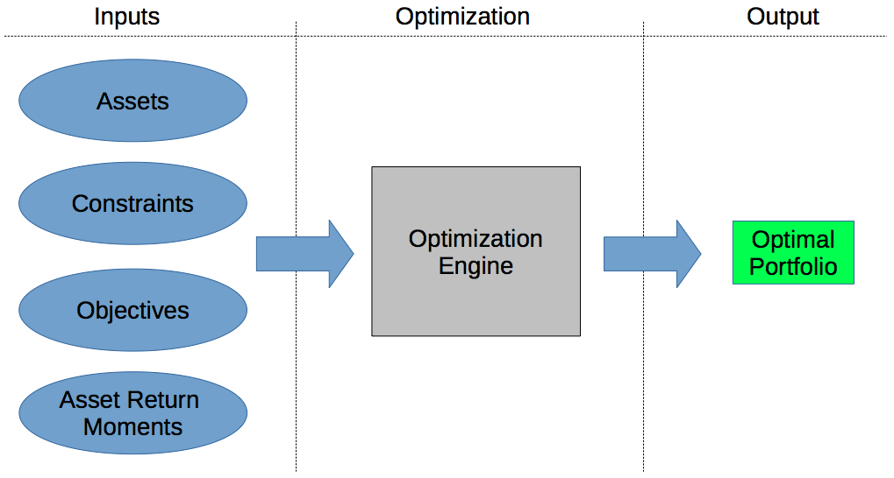


<!--
High level portfolio optimization framework

This diagram is a high level representation of a portfolio optimization
framework. The inputs are the assets, constraints, objectives, and moments of
asset returns. The assets, constraints, and objectives are defined by the
portfolio manager. The workflow in PortfolioAnalytics follows this diagram.
First, you specify a portfolio of assets, then add constraints and objectives to
the portfolio specification. Next, you run the optimization given the portfolio
specification and estimates of asset return moments. The final step is to
analyze the optimal portfolio which is the output of the solver.
-->

---

## Workflow: Specify Portfolio
```{r, eval = TRUE}
p <- portfolio.spec(assets = c('AAPL', 'MSFT', 'GOOG'))
print(p)
```

Initializes the portfolio object that holds portfolio level data, constraints,
and objectives

<!--
The portfolio object is an S3 object that holds portfolio-level data,
constraints, and objectives. The portfolio-level data includes asset names and
initial weights, labels to categorize assets, and a sequence of weights for
random portfolios. The main argument is assets which can be a character vector
(most common use), named numeric vector, or scalar value specifying number of
assets.
-->

---

## Workflow: Add Constraints
```{r, eval = FALSE}
# weights sum to 1
p <- add.constraint(portfolio = p, type = 'weight_sum',
                    min_sum = 1, max_sum = 1)
# special type for full investment constraint
# add.constraint(portfolio = p, type = 'full_investment')
# box constraints
p <- add.constraint(portfolio = p, type = 'box',
                    min = 0.2, max = 0.6)

```

Supported Constraint Types

* Sum of Weights
* Box, Group
* Factor Exposure
* Position Limit
* and many more

<!--
This adds a constraint object to the portfolio object. Constraints are added to
the portfolio object with the add.constraint function. Each constraint added is
a separate object and stored in the constraints slot in the portfolio object.
In this way, the constraints are modular and one can easily add, remove, or
modify the constraints in the portfolio object. Main argument is the type,
arguments to the constraint constructor are then passed through the dots (...).
-->

---

## Workflow: Add Objectives
```{r, eval = FALSE}
p <- add.objective(portfolio = p, type = 'risk', name = 'StdDev')
```

Supported Objective types

* Return
* Risk
* Risk Budget
* Weight Concentration

<!--
Objectives are added to the portfolio object with the add.objective function.
Each objective added is a separate object and stored in the objectives slot in
the portfolio object. In this way, the objectives are modular and one can easily
add, remove, or modify the objective objects. The name argument must be a valid
R function. Several functions are available in the PerformanceAnalytics package,
but custom user defined functions can be used as objective functions.
-->

---

## Workflow: Run Optimization
```{r, eval = FALSE}
opt <- optimize.portfolio(R, portfolio = p, optimize_method = 'random',
                          search_size = 2000)

opt.rebal <- optimize.portfolio.rebalancing(R, portfolio = p,
                                            optimize_method = 'random',
                                            search_size = 2000,
                                            rebalance_on = 'quarters',
                                            training_period = 60,
                                            rolling_window = 60)
```

<!--
* Notice the similarity between these two functions. You only have to specify a
few additional arguments for the backtesting.

* optimize.portfolio: Main arguments for a single period optimization are the
returns (R), portfolio, and optimize_method. We take the portfolio object and
parse the constraints and objectives according to the optimization method.

* optimize.portfolio.rebalancing: Supports periodic rebalancing (backtesting) to
examine out of sample performance. Helps refine constraints and objectives by
analyzing out or sample performance. Essentially a wrapper around
optimize.portfolio that handles the time interface.
-->

---

## Workflow: Analyze Results

Visualization | Data Extraction
------------- | ----------
plot | extractObjectiveMeasures
chart.Concentration | extractStats
chart.EfficientFrontier | extractWeights
chart.RiskReward | print
chart.RiskBudget | summary
chart.Weights | 

<!--
Brief explanation of each function.
-->

---

## Support Multiple Solvers

Linear and Quadratic Programming Solvers

* R Optimization Infrastructure (ROI)
    * GLPK (Rglpk)
    * Symphony (Rsymphony)
    * Quadprog (quadprog)

Global Solvers

* Random Portfolios
* Differential Evolution (DEoptim)
* Particle Swarm Optimization (pso)
* Generalized Simulated Annealing (GenSA)

<!---
Brief explanation of each solver and what optimization problems are supported
-->

---

## Random Portfolios

PortfolioAnalytics has three methods to generate random portfolios.

1. The **sample** method to generate random portfolios is based on an idea by Pat Burns.
2. The **simplex** method to generate random portfolios is based on a paper by W. T. Shaw.
3. The **grid** method to generate random portfolios is based on the `gridSearch` function in the NMOF package.

<!--
* Random portfolios allow one to generate an arbitray number of portfolios based
  on given constraints. Will cover the edges as well as evenly cover the
  interior of the feasible space. Allows for massively parallel execution.

* The sample method to generate random portfolios is based on an idea by Patrick
  Burns. This is the most flexible method, but also the slowest, and can
  generate portfolios to satisfy leverage, box, group, and position limit
  constraints.

* The simplex method to generate random portfolios is based on a paper by W. T.
  Shaw. The simplex method is useful to generate random portfolios with the full
  investment constraint, where the sum of the weights is equal to 1, and min box
  constraints. Values for min_sum and max_sum of the leverage constraint will be
  ignored, the sum of weights will equal 1. All other constraints such as the
  box constraint max, group and position limit constraints will be handled by
  elimination. If the constraints are very restrictive, this may result in very
  few feasible portfolios remaining. Another key point to note is that the
  solution may not be along the vertexes depending on the objective. For
  example, a risk budget objective will likely place the portfolio somewhere on
  the interior.

* The grid method to generate random portfolios is based on the gridSearch
  function in NMOF package. The grid search method only satisfies the min and
  max box constraints. The min_sum and max_sum leverage constraint will likely
  be violated and the weights in the random portfolios should be normalized.
  Normalization may cause the box constraints to be violated and will be
  penalized in constrained_objective.
-->

---

## Comparison of Random Portfolio Methods (Interactive!)
```{r, results = 'asis', comment = NA, message = F, echo = F}
load("figures/rp_viz.rda")
rp_viz$show('inline')
```

<!--
The feasible space is computed using the the first 5 assets of the EDHEC data
for a long only portfolio with a search size of 2000.
-->

---

## Random Portfolios: Simplex Method
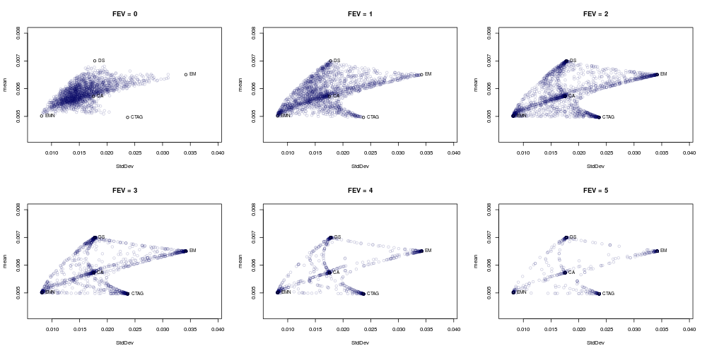

<!--
FEV (Face-Edge-Vertex bias values control how concentrated a portfolio is. This
can clearly be seen in the plot. As FEV approaches infinity, the portfolio
weight will be concentrated on a single asset. PortfolioAnalytics allows you to
specify a vector of fev values for comprehensive coverage of the feasible space. 
-->

---

## Hierarchical (i.e. Multilayer) Optimization

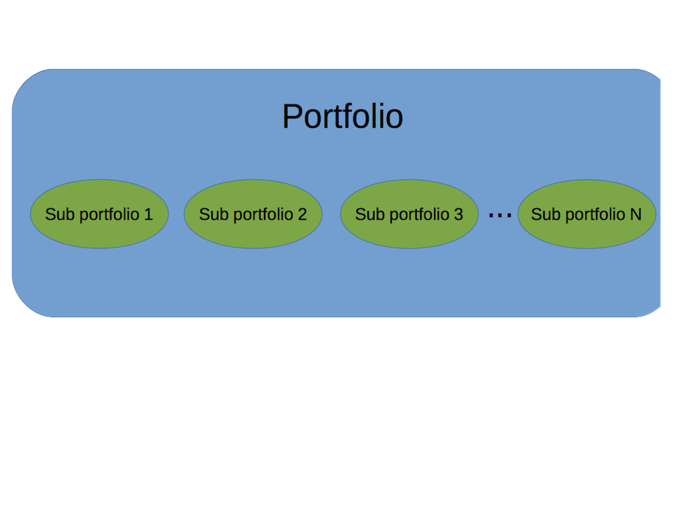

see [PortfolioAnalytics Tutorial R/Finance 2016](https://github.com/rossb34/PortfolioAnalyticsPresentation2016)

<!--
explanation of how the multilayer optimization works
start with portfolio of subportfolios
the subportfolios could be countries, sectors, strategies, etc.
optimize subportfolios
this gives us 'n' synthetic return streams for 'n' sub portfolios
we then optimize the top level portfolio using the 'n' synthetic return streams
-->

---

## Regime Switching Model

* Define a model to characterize `n` regimes
* Define `n` portfolio specifications, 1 for each regime

see [PortfolioAnalytics Tutorial R/Finance 2016](https://github.com/rossb34/PortfolioAnalyticsPresentation2016)

<!--
explanation of how the multilayer optimization works
start with portfolio of subportfolios
the subportfolios could be countries, sectors, strategies, etc.
optimize subportfolios
this gives us 'n' synthetic return streams for 'n' sub portfolios
we then optimize the top level portfolio using the 'n' synthetic return streams
-->

---

## Estimating Moments

Ledoit and Wolf (2003):

> "The central message of this paper is that nobody should be using the sample
> covariance matrix for the purpose of portfolio optimization."


* Sample
* Shrinkage Estimators
* Factor Model
* Expressing Views
  * [PortfolioAnalytics Tutorial R/Finance 2015](https://github.com/rossb34/PortfolioAnalyticsPresentation2015)
* See [Custom Moment and Objective Functions](https://cran.r-project.org/web/packages/PortfolioAnalytics/vignettes/custom_moments_objectives.pdf) vignette

<!--
From Ledoit and Wolf (2003), "Honey, I Shrunk the Sample Covariance Matrix"
The central message of this paper is that nobody should be using the sample 
covariance matrix for the purpose of portfolio optimization.

Estimating moments using shrinkage estimators, factor models, views are methods
to address the disadvantages of using sample estimates. I am not making a claim
that one method is better than another. The method chosen depends on one's own
situation and information/data available.

Increase risk of estimation error as dimension of assets and parameters to
estimate increase

Sample Estimates Disadvantages
  * Estimation error and the curse of dimensionality
  * In the Mean - Variance framework, small changes in expected returns can 
  lead to extreme portfolios (large long/short positions) in the unconstrained
  case and concentrated (large positions in few assets) portfolios wth long
  only constraint.
  * Note that adding constraints have of the effect of lessening the impact of 
  estimation error. TODO: reference? I remember Doug stating this

The estimation of a covariance matrix is unstable unless the number of
historical observations T is greater than the number of assets N. 
10 years of data
daily: 2500
weekly: 520
monthly: 120

One has the choice to estimate moments with historical or simulated data.

Historical Data
  * do you have enough data?
  * missing assets
  * is it clean?

Simulated data
  * Model risk
  * How well does the model describe the data?

* Shrinkage Estimators
  * Ledoit-Wolf
  * James-Stein
* Factor Model
  * Fundamental
  * Statistical
  * Boudt et al (2014) use factor model to estimate higher order comoments
* Expressing Views
  * Black - Litterman
  * Almgren and Chriss, Portfolios from Sorts
  * Meucci, Fully Flexible Views Framework
* Other
  * Resampling
  * ?

-->

---

## Example: U.S. Equity Sector ETF Portfolio

Consider a long only U.S. Equity portfolio allocation problem

Data

* Monthly returns of 9 U.S. Equity Sector ETFs from 1999 to May 2016
* Source: Yahoo

Approach

* Baseline portfolio 
* Box constraints
* Custom objective function
* Analysis

Goal is to outperform the S&P 500 (SPY as a proxy)

<!--
* start with a simple portfolio specification, then add more complexity
-->

---


## Baseline Portfolio Specification

Baseline portfolio specification to minimize portfolio standard deviation, 
subject to full investment and long only constraints.

```{r, eval = FALSE}
# base portfolio specification
p <- portfolio.spec(assets = colnames(R), 
                    weight_seq = generatesequence(min = 0, max = 1, by = 0.002))
p <- add.constraint(portfolio = p, type = 'weight_sum', 
                    min_sum = 0.99, max_sum = 1.01)
p <- add.constraint(portfolio = p, type = 'box', min = 0, max = 1)
p <- add.objective(portfolio = p, type = 'return', name = 'mean', multiplier = 0)
p <- add.objective(portfolio = p, type = 'risk', name = 'StdDev')
```

---

## Box Constraints

Add box constraints such that for each asset the minimum weight is 5% and the
maximum weight is 20%.

* copy the baseline portfolio specification
* replace the second index of the constraint object

```{r, eval = FALSE}
# portfolio specification with box constraints
p.box <- p
p.box <- add.constraint(portfolio = p.box, type = 'box', 
                        min = 0.05, max = 0.20, indexnum = 2)
```

---

## Single Period Optimization

Run a single period optimization for the portfolio specifications

```{r, eval = FALSE}
# generate the random portfolios
rp <- random_portfolios(portfolio = p, permutations = rp.n, method = 'sample')
rp <- normalize.weights(rp)
rp.box <- random_portfolios(portfolio = p.box, permutations = rp.n, method = 'sample')
rp.box <- normalize.weights(rp.box)

# run the optimizations
opt.base <- optimize.portfolio(R = tail(R, 36), portfolio = p, rp = rp,
                               optimize_method = 'random', trace = TRUE)
opt.box <- optimize.portfolio(R = tail(R, 36), portfolio = p.box, rp = rp.box,
                              optimize_method = 'random', trace = TRUE)
```

---


## Feasible Space Comparison

Impact of box constraints on the feasible space of the in sample period.

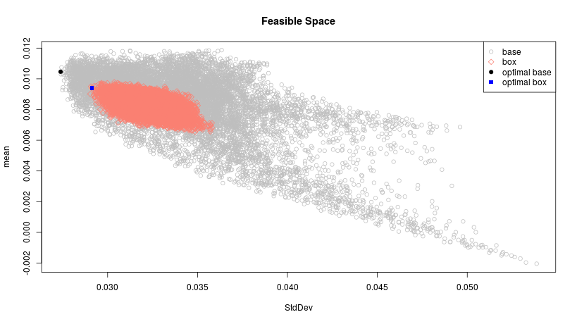

---

## Optimization with Periodic Rebalancing

```{r, eval=FALSE}
opt.base.rebal <- optimize.portfolio.rebalancing(R = R, portfolio = p,
                                                 optimize_method = 'random',
                                                 rp = rp, trace = TRUE,
                                                 rebalance_on = 'quarters',
                                                 training_period = 36,
                                                 rolling_window = 36)
opt.base.rebal.r <- Return.portfolio(R, weights = extractWeights(opt.base.rebal))
colnames(opt.base.rebal.r) <- 'base'

opt.box.rebal <- optimize.portfolio.rebalancing(R = R, portfolio = p.box,
                                                optimize_method = 'random',
                                                rp = rp.box, trace = TRUE,
                                                rebalance_on = 'quarters',
                                                training_period = 36,
                                                rolling_window = 36)
opt.box.rebal.r <- Return.portfolio(R, weights = extractWeights(opt.box.rebal))
colnames(opt.box.rebal.r) <- 'box'
```


<!--
* evaluate out of sample performance
-->

---

## Baseline Optimal Weights

```{r, eval=FALSE}
chart.Weights(opt.base.rebal, main = 'Baseline Portfolio Optimal Weights')
```

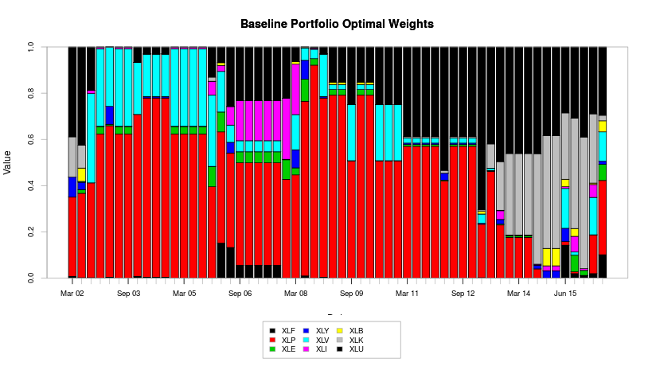

---

## Box Constrained Optimal Weights

```{r, eval=FALSE}
chart.Weights(opt.box.rebal, main = 'Box Constrained Portfolio Optimal Weights')
```

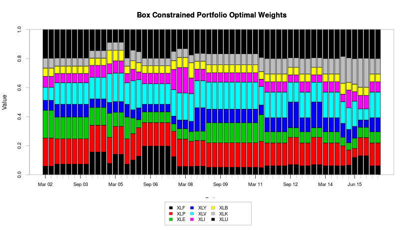


---

## Baseline and Constrained Performance Summary

```{r, eval=FALSE}
opt.r <- cbind(opt.base.rebal.r, opt.box.rebal.r)
charts.PerformanceSummary(opt.r, main = "Performance Summary")
```

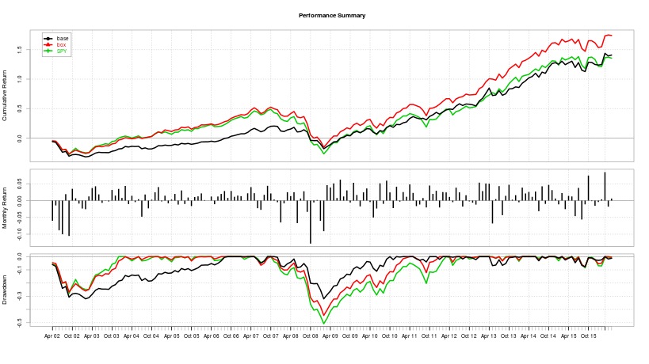

---

## Tracking Error Custom Objective Function

Define a custom objective function for penalized tracking error

```{r, eval=FALSE}
te.target <- function(R, weights, Rb, min.te = 0.02, max.te = 0.05, scale = 12){
    r <- Return.portfolio(R = R, weights = weights)
    Rb <- Rb[index(r)]
    te <- sd(r - Rb) * sqrt(scale)
    # penalize tracking error outside of [min.te, max.te] range
    out <- 0
    if(te > max.te)
        out <- (te - max.te) * 10000
    if(te < min.te)
        out <- (min.te - te) * 10000
    out
}
```

---

## Tracking Error Target Optimization

* Add tracking error  as an objective to the baseline portfolio specification
* Specify the arguments to `te.target` as a named list
* Target an Annualized Tracking Error in the range of 3% to 5%

```{r, eval=FALSE}
p.te <- p
p.te <- add.objective(portfolio = p, type = 'risk', name = 'te.target',
                      arguments = list(Rb = R.mkt, scale = 12,
                                       min.te = 0.03, max.te = 0.05))

opt.te.rebal <- optimize.portfolio.rebalancing(R = R, portfolio = p.te,
                                                optimize_method = 'random',
                                                rp = rp, trace = TRUE,
                                                rebalance_on = rebal.period,
                                                training_period = n.train,
                                                rolling_window = n.roll) 
opt.te.rebal.r <- Return.portfolio(R, weights = extractWeights(opt.te.rebal))
colnames(opt.te.rebal.r) <- 'te.target'
```

---

## Tracking Error Target Performance Summary

```{r, eval=FALSE}
opt.r <- na.omit(cbind(opt.base.rebal.r, opt.box.rebal.r, opt.te.rebal.r, R.mkt))
charts.PerformanceSummary(opt.r, main = "Performance Summary")
```

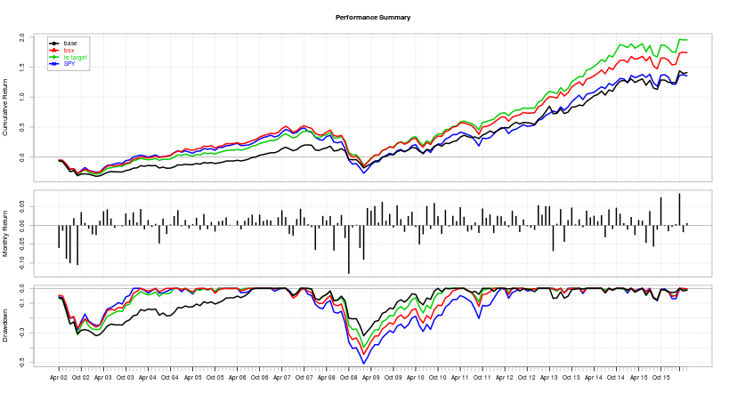

---

## Portfolio Simulation and Analysis

* Random portfolios to simulate portfolios of zero skill managers
* Feasible portfolios by construction
* Monte Carlo requires a model specification
* Time series dependency with bootstrap
* No guarantee of a feasible portfolio with bootstrap or Monte Carlo Simulation

<!--
simulate the returns of feasible portfolios based on the specified constraints
and rebalancing frequency
-->

---

## Simulate Portfolio Returns

Simulate portfolio returns using the random portfolios generated from the
baseline portfolio specification and box constrained portfolio specification.

```{r, eval=FALSE}
sim.base <- simulate.portfolio(R, rp = rp, simulations = 5000, 
                               rebalance_on = 'quarters')
sim.box <- simulate.portfolio(R, rp = rp.box, simulations = 5000, 
                              rebalance_on = 'quarters')
sim <- cbind(sim.box, sim.base)
charts.PerformanceSummary(sim, colorset = c(rep("salmon", ncol(sim.box)), 
                                            rep('gray', ncol(sim.base))), 
                          legend.loc = NULL, main = "Simulated Performance Summary")
legend('topleft', legend = c('constrained', 'unconstrained'), 
       fill = c('salmon', 'gray'), bty = 'n')
```

---

## Simulated Portfolio Performance Summary

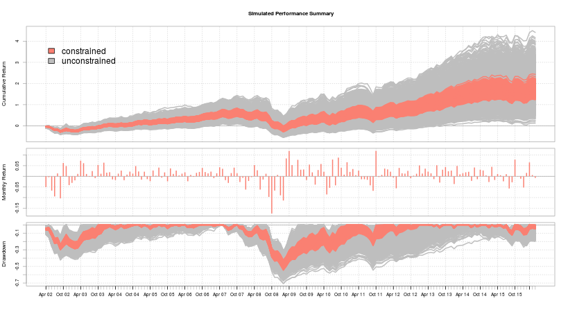

---


## Simulated vs. Optimal Portfolios: Sharpe Ratio Distribution

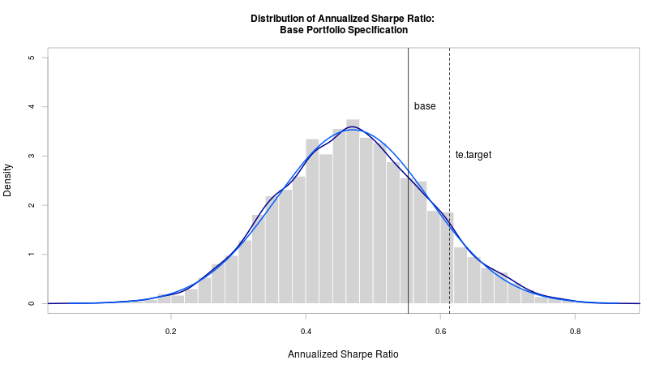

---

## Simulated vs. Optimal Portfolios: Sharpe Ratio Distribution

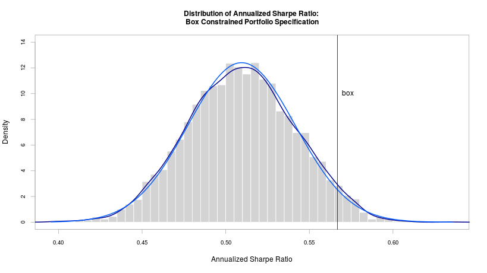

---

## Simulated vs. Optimal Portfolios: Tracking Error Distribution

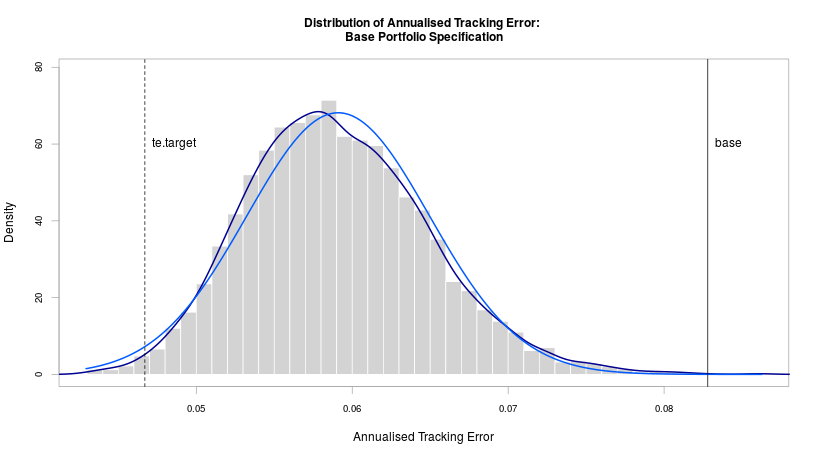


---

## Improvements

* Risk Measures
  * Expected Shortfall
  * Component contribution to risk (i.e. Risk Budgeting)
* Better Estimates
  * Factor Model
  * GARCH
  * Return Forecasts
* More Data
  * Weekly or daily frequency
    * downsampling to monthly frequency "throws away" a lot of data
  * Estimates based on higher frequency data

---

## Conclusion

* Introduced the goals and summary of PortfolioAnalytics
* Demonstrated the flexibility through examples
* Plans for continued development
    * Interface to $parma$
    * Additional solvers
    * "Gallery" of examples

#### Acknowledgements
Many thanks to...

* Google: funding Google Summer of Code (GSoC) for 2013 and 2014
* GSoC Mentors: Brian Peterson, Peter Carl, Doug Martin, and Guy Yollin
* R/Finance Committee

<!---
Hammer home the point of modular architecture and ability to "plug" custom
moments and objective functions to define your own optimization problems
- One of the best things about GSoC is the opportunity to work and interact
with the mentors.
- Thank the GSoC mentors for offering help and guidance during the GSoC project
and after as I continued to work on the PortfolioAnalytics package.
- R/Finance Committee for the conference and the opportunity to talk about
PortfolioAnalytics.
- Google for funding the Google Summer of Code for PortfolioAnalytics and many
other proposals for R

Thank everyone for attending
I hope they learned something and are motivated to use PortfolioAnalytics
-->

---

## PortfolioAnalytics Links

* [PortfolioAnalytics on CRAN](http://cran.at.r-project.org/web/packages/PortfolioAnalytics/index.html)

* [PortfolioAnalytics on GitHub](https://github.com/braverock/PortfolioAnalytics)

Source code for the slides

* https://github.com/rossb34/PortfolioAnalyticsPresentation2017

and view it here

* http://rossb34.github.io/PortfolioAnalyticsPresentation2017/

DataCamp Course

* https://www.datacamp.com/courses/intermediate-portfolio-analysis-in-r

---

## Any Questions?

---

## References and Useful Links

* [ROI](http://cran.r-project.org/web/packages/ROI/index.html)
* [DEoptim](http://cran.r-project.org/web/packages/DEoptim/index.html)
* [pso](http://cran.r-project.org/web/packages/pso/index.html)
* [GenSA](http://cran.r-project.org/web/packages/GenSA/index.html)
* [PerformanceAnalytics](http://cran.r-project.org/web/packages/PerformanceAnalytics/index.html)
* [Patrick Burns Random Portfolios](http://www.burns-stat.com/pages/Finance/randport_practice_theory_annotated.pdf)
* [W.T. Shaw Random Portfolios](http://papers.ssrn.com/sol3/papers.cfm?abstract_id=1856476)
* [Improved Forecasts of Higher-Order Co-moments and Implications for Portfolio Selection](http://docs.edhec-risk.com/EAID-2008-Doc/documents/Higher_Order_Comoments.pdf)
* [Higher Order Comoments of Multifactor Models and Asset Allocation](http://papers.ssrn.com/sol3/papers.cfm?abstract_id=2409603)

